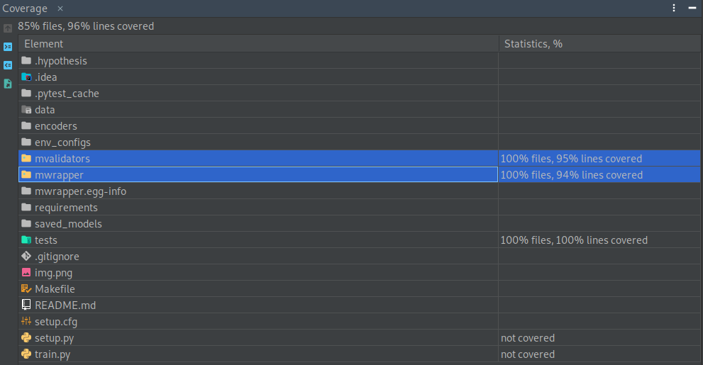

# Machine learning TDD example.
======

This is a baseline framework for wrapping custom machine learning and deep learning models for the lending tabular
dataset. The wrapper model has `fit`, `predict`, `predict_proba` and `evaluate`
methods following the scikit-learn model api.

The model's `tune_parameters` method does hyperparameter tuning on selected model parameters using the Optuna library.

The wrapper validates the schema defining the data and underlying model parameters before training and prediction
using `pydantic` and `pandera`. This allows for property based testing using `hypothesis` and run time data validation.

This baseline framework can be extended to deep learning models developed using `pytorch` and `pytorch-lightning`. The
performance of these models can be compared to models from `scikit-learn`.

Setup environment and install libraries:
---
---
Assuming python, pip and virtualenv are installed on the system.

Clone repository:

`git clone https://github.com/ganprad/ml-tdd-example.git`

`cd ml-tdd-example`

__Use`conda` and `pip-tools`:__

Use `conda` to setup a python environment for CUDA and MKL optimized packages and `pip-tools`
to manage python dependencies.

To install CUDA toolkit: `make conda-gpu`

To install Without CUDA: `make conda-cpu`

Use pip-tools to install python dependencies:

`make pip-tools`

__Use`virtualenv`:__

Setup python environment:

On Linux and Mac:

`virtualenv -p /usr/bin/python3 venv --prompt ml_wrapper`

Activate the environment:

`source ./venv/bin/activate`

Install requirements:

`pip install -r requirements/requirements.txt`

Install the package:

`pip install -e .`

Preprocessing and encoding steps:
---
___

1. The columns `emp_length` contains `na` values. These are considered as not available and replaced with the
   value `-1.0`.
2. `NaN` values in columns are replaced with `-1.0` in both categorical and numerical columns.
3. Assuming all categories in the column `purpose_cat` represent small business based categories. For example, the
   column `purpose_cat` contains values equal to `small business`
   and `small business small business`. The preprocessing code changes `small business small business` values
   to `small business`. This increases the count of `small business`.
4. Numerical columns are scaled using the `MinMaxScaler` class from scikit-learn.
5. Categorical columns are converted to one hot encoded columns using the scikit-learn `OneHotEncoder`.
6. The input dataframe is split into a dataframe of features `X` and a 1D numpy array of target values `y`.
7. Preprocessing functions are located in `utils.py`.

Model
---
___
__Functionality__:

* Model inherits from an abstract base class called `BaseWrapperModel`.
* The `BaseWrapperModel` is a template that defines the functional requirements of the model using abstract methods.

__Underlying model__:

* `LogisticRegression` from the `scikit-learn` library is chosen as the underlying model.
* The baseline model has an elastic net penalty. This allows for adjusting `l1` regularization strength in relation
  to `l2` regularization.

__Tuning parameters__:

* Three model parameters can be tuned, these are `C`, `max_iter` and `l1_ratio`.
* Hyper parameters are defined as custom `pydantic` types.
* `OptunaSearchCV` is used for performing cross validation during model training:
    * Hyper-parameter sampling is done using `optuna.distributions`.
    * f1-score is used as the tuning objective.
    * The type of cross validation is `RepeatedStratifiedKfold` when `n_repeats > 0`
      otherwise it is `StratifiedKFold`.
    * After cross-validation the model is refit with the best parameters from the study and saved into the models
      directory.
* The output of `tune_parameters` is a dictionary containing the best search parameters and corresponding scores.

Unit Tests
---
---
Unit tests are located in `tests/test_model.py`.

`Hypothesis` was used for writing parametrized schema tests in combination with `pydantic` and `pandera`.

The model inputs are validated by schemas defined using `pydantic`. The dataset features have to be checked to ensure
that the model makes predictions on data that originates from the same data generating process as the training data.
The `pandera` library makes it possible to do schema validation in combination with statistical validation. It also
allows for synthesising data for testing.

References:

* https://arxiv.org/abs/2012.12028
* https://github.com/HypothesisWorks/hypothesis/tree/master/hypothesis-python
* https://pydantic-docs.helpmanual.io/
* https://pandera.readthedocs.io/en/stable/
